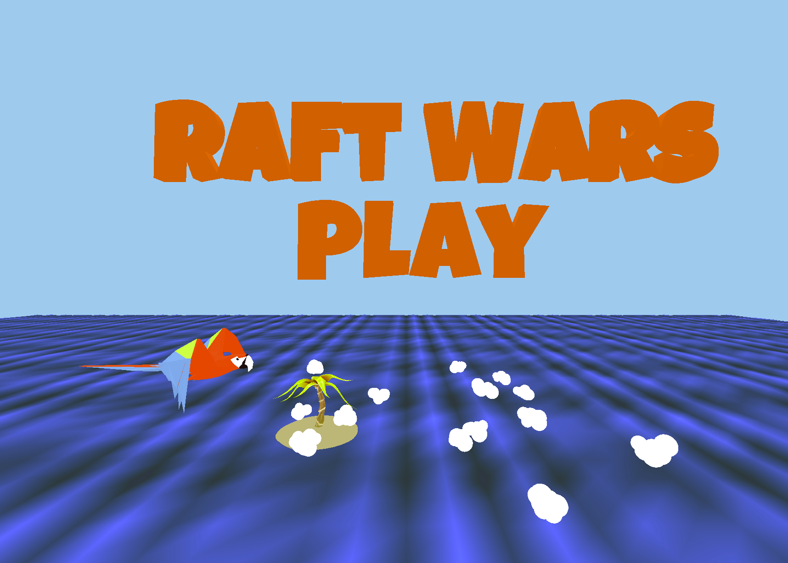
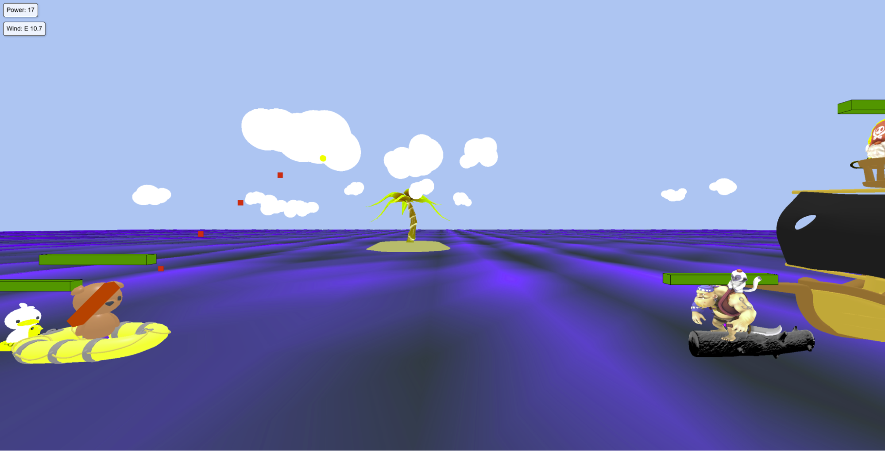
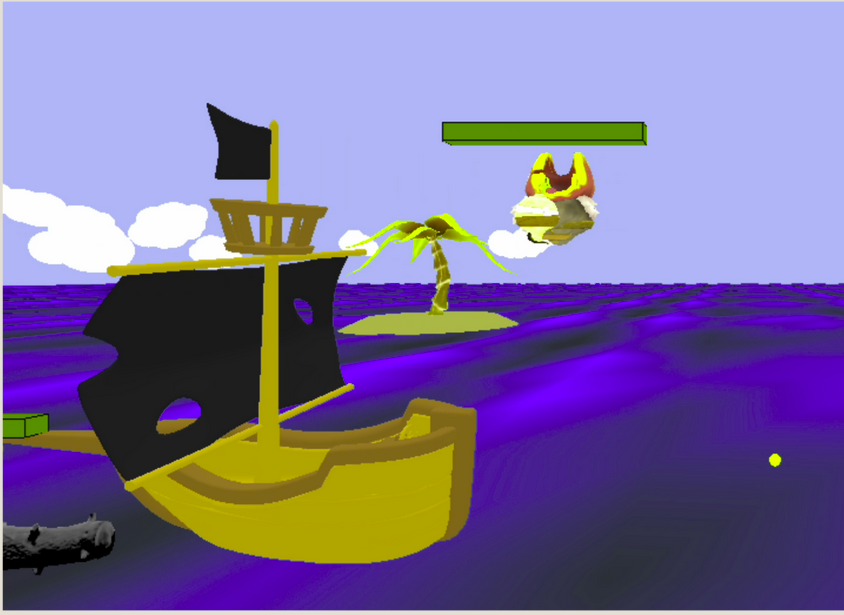
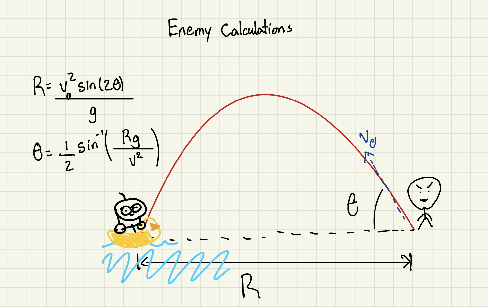
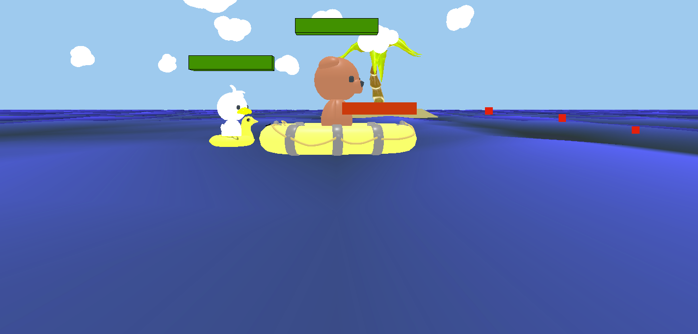

# Raft Wars

Members: Benjamin Avalos, Diana Chu, Lyra Latifi

*Figure 1: Screenshot of gameplay in level 2*

## Theme

In the game Raft Wars, players take on the role of two brothers trying to defeat different groups of enemies they encounter on the sea by shooting a cannonball at the enemies. The player must defeat all the enemies across the ocean before they get knocked off the raft themselves by the enemies' shots. Each level provides a unique environment and obstacles that the brothers have to overcome to advance to the next level.

## Topics Learned in Course

In our project, we will implement the following features learned in class:

- **Modeling and Matrix Transformations:** render the players, enemies, weapons and landscape. Give motion to the cannonball when it is shot and to the players and enemies floating on top of the ocean.
- **Bump Mapping:** We used bump mapping on the tennis ball to give it a more realistic look and effect.
- **Changing of perspective:** transform the camera to follow the movement of the cannonball along its projectile path when the user shoots.

## Interactivity

- **Arrow Keys Up/Down:** Adjust the cannon's vertical angle. Pressing Up will increase the firing angle (projectile arcs higher), and Down will lower it.
- **Arrow Keys Left/Right:** Adjust the projectile's initial speed. Left decreases power, Right increases it.
- **Spacebar:** Fire the currently selected weapon (cannon or rocket launcher). After firing, the camera briefly follows the projectile along its trajectory.
- **Mouse:** Hovering over menu items changes their color. Click to select "Play" or a level. During the game, clicking on future interactive text (e.g., "Next Level >>") progresses the game.

## Gameplay

The game initializes to the title page, where the player is presented with the main menu. From here, they can click the "play" button, which prompts them with two levels to choose from: level 1 and level 2. Once the user selects their level, they are taken to the gameplay scene. Here, the user begins to play the game.

The user shoots at the enemies with their cannonball, and the enemies shoot back, calculating a new angle each turn. The user attempts to win by knocking the enemies off of their boat completely, or depleting the enemies' health bars to zero through many hits. In level 1, the user shoots at two cube-shaped enemies placed on a flat bamboo raft. In level 2, the user shoots at a villager enemy and a pirate enemy, placed on a log and in a pirate ship, respectively. After clearing level 1, the user is met with a victory message on the screen, and a button to advance to the next level. After defeating all enemies, a victory message is displayed and the game ends with the camera centered on the victory message.

## Initial Demo Feedback

Based on the feedback received through Peerceptiv, we implemented several enhancements to our game. We added an additional level, improved character visuals using Sketchfab assets, and created a wave effect utilizing custom GLSL shaders. Additionally, we introduced a wind factor affecting projectiles and implemented a health bar reduction mechanism triggered by collision detection. Overall, the peer review process was highly beneficial, providing valuable insights that helped us expand and refine our game features.

## Features Implemented

- **Swaying effect on the raft and water**
  - To make the game more realistic, we added the wobble effect to the rafts and water by using a sine function within `animate()`.

- **Projectile preview path**
  - Based on the peer review suggestion, we added a preview of the projectile path to simulate at what angle the cannonball will be shot by simulating the projectile path after time *t* using standard physics equations incremented at fixed time intervals.

- **Visual representation of wind and power**
  - On the top left corner of the game, we added a graphic representation of whether the wind goes to the east or west, its speed, and how much power applies to the cannonball which affects the initial velocity of the projectile.

- **Health bars**
  - Over each of the player and enemies, we added health bars that decrease by some amount depending on the speed of the object/character colliding with it. It does it by checking the bounding box applied to each object to see if they intersect with each other. Once the health percentage reaches 0%, the character will sink in the water and disappear.

- **Bouncing**
  - When a character collides within the range of the raft or with another player after knockback, the initial velocity is reduced. The character's velocity is adjusted to simulate a bouncing motion, factoring in collision direction, gravity, and friction over time. This creates a realistic effect of the character rebounding off the surface or another object.

- **Additional level**
  - To add more variability in the game, in the introduction, the player will get to choose which level they want to play through the menu option. On level 1, the player shoots enemies from the same ground level. On level two, the player gets to defeat the enemy on different levels of elevation.

- **Raycasting**
  - Implemented raycasting to detect mouse interactions with different objects in the scene. This allows for selecting menu options like starting the game or selecting which level you want to play. It also enhances the user experience by providing feedback such as changing the text colors.

- **Physics-based simulation**
  - The player will shoot a cannon ball which follows properties of projectile motion from physics classes. Depending on the angle, the power of the shot, and the position of the cannonball, where it lands at the end of its path will differ. The enemy will shoot back using projectile motion at a dynamically calculated position and angle (see below).
  - After the current turn ends (enemy team has fired their shot), the wind strength & direction changes. We added this feature to provide more replayability and variety within each turn, which is feedback we got from our peer reviews as well.

- **Collision detection**
  - To implement collision detection, we utilized Axis-Aligned Bounding Boxes (AABB) to detect if a projectile/character has gotten within range of another character.
  - We will use collision detection to see if the cannonball hits anything in the environment each time it is shot. If the cannonball hits one of the enemies, then they will get knocked back with respect to a momentum calculation. In some cases, there will also be a chain effect of multiple collisions when multiple enemies bump into each other.

  

  *Figure 2: Screenshot of enemy falling off pirate ship after being hit with cannonball*

- **Dynamic Enemy Attack Calculations**
  - Enemies will use algorithms to calculate angles and power to shoot back fairly accurately at the player. With a randomized initial power between 14 to 25, the AI uses the equation , with R being the distance from it to the player, and g = 9.8 to find the best angle to shoot from. We added a randomized angle offset of 15 degrees, so that it is still fair to the players and they don't get hit every single turn.

  

  *Figure 3: Physics calculations for enemy shooting angles*

- **GLSL Water Shaders**
  - The custom GLSL shaders implement a dynamic water surface effect by applying wave-like distortions to the mesh's vertices. Using uniform variables for time, wave height, frequency, and speed, the vertex shader continuously updates the water surface's geometry to produce a natural, undulating motion.
  - In the fragment shader, the water's color and opacity are modulated based on the computed wave displacement, blending the base water color with a simulated sky reflection. This results in a more visually appealing surface that subtly shifts and changes, giving the illusion of real-time reflections and specular highlights on the water.

  

  *Figure 4: Screenshot of scene depicting water shaders*

## Challenges Faced / Lessons Learned

- Implementing accurate collision detection using Axis-Aligned Bounding Boxes (AABB) was challenging, especially when detecting complex interactions like bouncing projectiles or chain reactions between multiple objects. Fine-tuning the collision response to ensure realistic knockback effects required iterative testing and debugging.
- Through the implementation of our project, we learned the importance of debugging through various sorts of techniques. We used tools like `BoxHelper` and logging collision events in the console to tell where things went wrong with the various collision-related bugs we encountered.
- Through version control features in GitHub, we learned how to reduce integration issues with each other's code with things such as merge conflicts.
- We also learned how to effectively work together as a team to make sure that we were making good progress throughout the code while taking into consideration things like other classes we were occupied with.

## Future Implementations

- Had we had more time, our team would have liked to implement two player functionality, where they can play against each other and use WASD to control the aiming and power as we have already implemented. We were going to focus on this next, since we had received it in the peer feedback.
- We also would have made aiming a bit of a smoother experience like we thought of when we had the idea of using the mouse to aim the direction the cannon shoots.
- We would have liked to implement actual ray tracing in our program, but we didn't have enough time to get to this point.

## Peer Review Process / Suggestions

We found the peer review process to be helpful and engaging. The feedback provided to us by other teams allowed us to improve our project and refine our goals as we worked towards the final demo. Giving feedback to our peers was also useful, as it allowed us to give comments on other groups to help them determine their final goals, and suggest additions/edits after watching the demos. We felt that the peer/team member review process was well-implemented, enjoyable, and a useful part of the course.

## Custom Models Used

- <https://sketchfab.com/3d-models/tau-cannon-bm-design-modeling-for-game-hw-6307ecbff1dd44e2ac53cf4e591fafc2>
- <https://sketchfab.com/3d-models/pirate-00200996b8f34f55a2dd2f44d316d107>
- <https://sketchfab.com/3d-models/pirate-ship-6b32fb0dac4c4e79a2a09a93559302e8#download>
- <https://sketchfab.com/3d-models/log-27624ee05fea49899ba2a63e2f6d1e34>
- <https://sketchfab.com/3d-models/lord-pirate-maplestory-5a6fbb9b3ccf48e0b76850c1c837c823>
- <https://kaylousberg.itch.io/kay-kit-mini-game-variety-pack>
- <https://github.com/mrdoob/three.js/blob/master/examples/webgl_gpgpu_birds_gltf.html>
- <https://sketchfab.com/3d-models/raft-by-henri-9cee65228d8f435dbd6dfd6ef900ccba>
- <https://sketchfab.com/3d-models/raft-07b4974fd6ca434fbbec3144ad67d1f8>